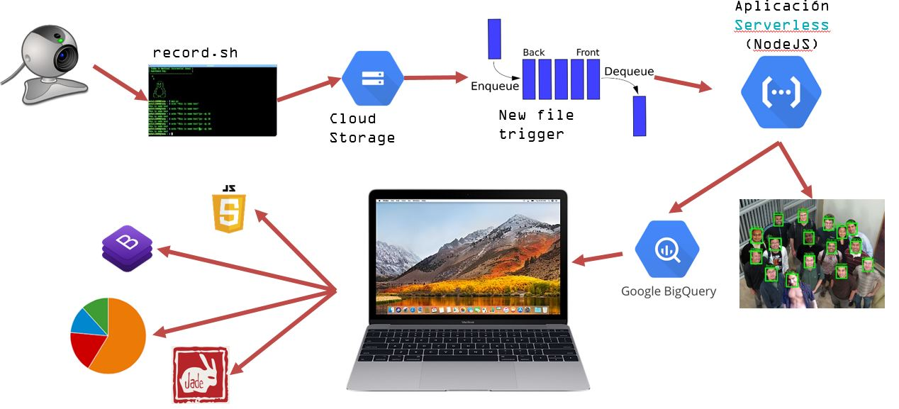

# realtimetalksentiment

Near Real Time Talks Sentiment using Google Cloud Vision API 



## Instrucciones

Una vez configurado el entorno y subido el codigo de la función, lanzar el fichero record.sh

```
> ./record.sh
```

Las imagenes comenzaran a publicarse y se activará el evento de la funcion que procesará su contenido.

Para el visor, hay que poner en marcha el viewer/app.js en la misma maquina donde se estan tomando las fotos (ya que se muestran las fotos desde la carpeta local);

## Prerequisitos

### Configuración

Crear el proyecto en Google Cloud Platform
Establecer el project ID en el fichero index.js:

```
const bigquery = BigQuery({
    projectId: "realtimesentiment-204610"
})
```


Habilitar Google Vision API
Crear un segmento (p.ej. findemortalksentiment, Coldline) en el Storage del proyecto


### Instalar [ImageSnap](http://iharder.sourceforge.net/current/macosx/imagesnap/)

Herramienta en linea de comandos para tomar capturas con la webcam.
Descomprimir en /usr/local/bin, por ejemplo

```
> tar -xvzf ImageSnap-v0.2.5.tgz
> mv ImageSnap-v0.2.5/* /usr/local/bin/
```

### Instalar el SDK de [Google Cloud Platmform](https://cloud.google.com/sdk/?hl=es)

Instalar el Google Cloud SDK para storage (gsutil)

```
> curl https://sdk.cloud.google.com | bash
> exec -l $SHELL
# Reiniciar shell
> gcloud init
```

### Preparar el BigQuery

Crear el dataset "realtimesentiment" en el proyecto en [BigQuery](https://bigquery.cloud.google.com/queries)
Crear la tabla samples a partir del fichero json "samples/samples.json"

### Crear y configurar función de google Cloud Functions

Habiligar las Google Cloud Function
Crear una función de Google Cloud Function (p.ej. fn-realtimesentiment-event)
Asignar 128MB
Activador: Segmento de Cloud Storage
Tipo de evento: Finalizar/Crear
Segmento: findemortalksentiment (el creado antes)
Codigo fuente: Editor insertado
Funcion que ejecutar: newSentimentStatus

### Para el visor

1. Crea unas [credenciales](https://cloud.google.com/bigquery/docs/reference/libraries) de autenticación para el proyecto de google cloud platform

Nueva cuenta de servicio
Funcion: lectura de datos


## Enlaces

[Cloud Functions](https://console.cloud.google.com/functions/list?project=realtimesentiment-204610&hl=es)
[Cloud Storage Segmento](https://console.cloud.google.com/storage/browser/findemortalksentiment?project=realtimesentiment-204610&folder&organizationId)
[BigQuery](https://bigquery.cloud.google.com/table/realtimesentiment-204610:realtimesentiment.samples)


## Troubleshooting

Si no esta funcionando correctamente la función (no hace lo esperado) ir a Registros en la consola de las Cloud Functions y comprobar el registro de errores. A menudo se debe a que no se han dado permisos a alguno de los recursos.
